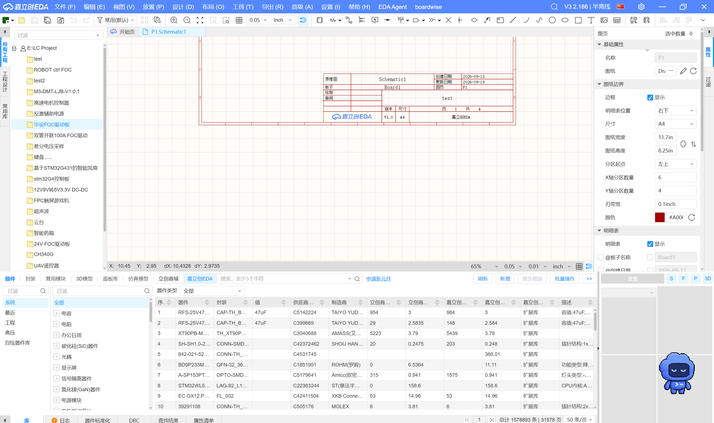
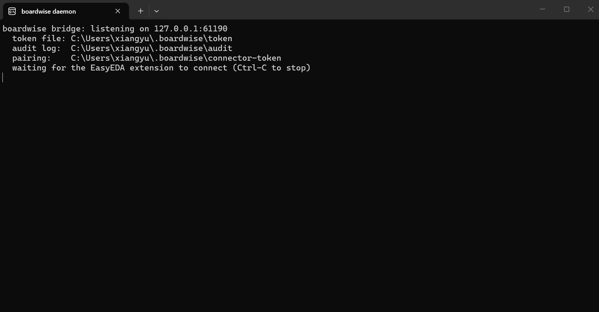
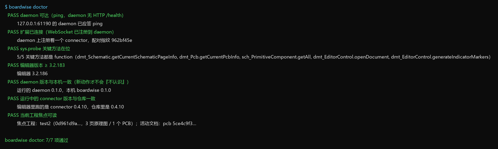
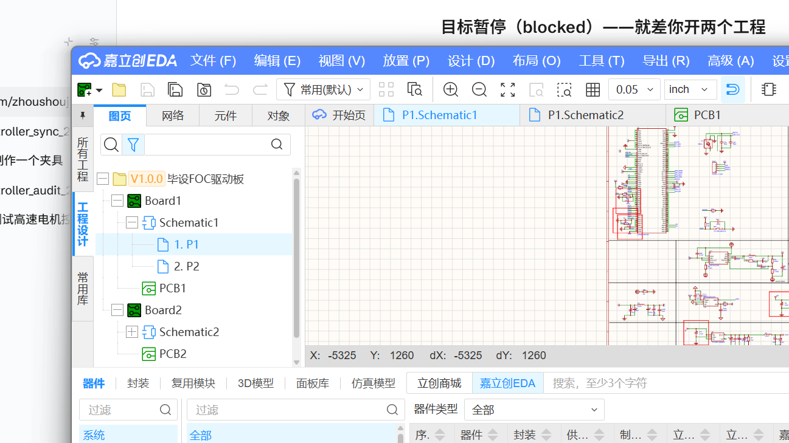
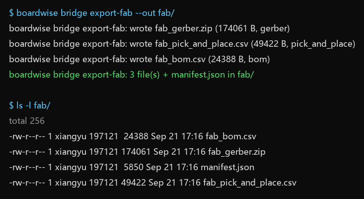

# boardwise 上手（给同事的操作说明）

这份文档面向**不是程序员**的同事：从零把 boardwise 装起来，跑通第一次设计审查，导出一次打板文件。
每一步都写了"应该看到什么"，看到的东西不对就停下来看该步末尾的"不对怎么办"。

全程大概 15 分钟，只有第 2 步和第 5 步需要你在编辑器里点几下，其余都是敲命令。

> **关于截图**：每一步都有一个 `截图位`，六张全部就位（2026-09-21 补齐：gs-01/03 岳手截，
> 其余为终端渲染与真机打标抓图）。gs-01 只保留版本号区域，授权信息已裁掉。

**这台机器需要**：Windows 10/11、立创 EDA Pro **3.2.183 或更高**（推荐 3.2.186）、Python 3.10 以上。

> **重要：一次只开一个编辑器窗口。** 每个窗口的扩展都会各自连上 daemon，而 daemon 只认
> 最后注册的那个——开着多个窗口时，命令会打到哪个窗口是说不准的（2026-09-21 真机实测：
> 同样的命令被旧窗口答了新窗口的事）。要用 boardwise 时，把多余的编辑器窗口关掉，只留一个。

---

## 第 1 步 · 安装立创 EDA Pro

1. 打开 <https://pro.easyeda.com/>，下载并安装 **立创 EDA Pro**（桌面版）。
2. 启动一次，确认能打开"开始页"。

预期：窗口标题栏里有版本号，`帮助 → 关于` 里能看到 **3.2.183 以上**的版本。

不对怎么办：版本低于 3.2.183 时，boardwise 依赖的几个画布接口（打标、缩放）在编辑器里根本不存在。
升级到最新版再来。（旧版本上扩展本身**连得上**——connector 0.4.15 起模块加载即自举，
2026-09-23 在 3.2.149.88089769 上实测冷启动照常连上并配对——但 `doctor` 的编辑器版本项
仍会红，打标/缩放也用不了，所以该升级还是要升级。）

> 截图位：`docs/images/gs-01-editor-about.png` —— `帮助 → 关于` 的版本号那一行。
> （已补：2026-09-21 岳手截——只保留版本号区域，授权信息已裁掉。）


---

## 第 2 步 · 装 boardwise 扩展（.eext）

boardwise 的编辑器插件是一个 `.eext` 文件（就是一个 zip）。它负责"替你把话传给编辑器"。

**拿到 .eext 的两条路**（任选一条）：

- 同事已经给你 `boardwise-connector-*.eext`：直接用它。
- 你自己从仓库构建：

  ```bash
  cd connector
  npm install
  npm run package
  ```

  预期：命令结束后在 `connector/` 目录下出现 `boardwise-connector-<版本>.eext`，脚本会把文件名打印出来。
  **不是 `dist/`**——`dist/` 里只有 `index.js`（打进 `.eext` 的那份 bundle）和测试用的 `esm/`。

**导入编辑器**：

1. 立创 EDA Pro → `扩展`（或设置里的扩展管理）→ `导入扩展` → 选中那个 `.eext`。
2. **完全关闭编辑器再重新打开**。这一步不能省：编辑器只在启动时读一次扩展代码，热导入常常"看起来成功、
   其实还在跑旧版本"。
3. 首页、原理图页、PCB 页的顶部菜单里应该出现 **boardwise** 这一项。

预期：菜单点 `boardwise → About…`，弹出的小框里能看到连接状态与 token 状态（**不会**显示 token 本身）。

不对怎么办：菜单里没有 boardwise → 导入没生效，重做第 2 步（记得重启编辑器）。

> 截图位：`docs/images/gs-02-extension-menu.png` —— 菜单里的 boardwise 与 `About…` 弹框。
> （已补：2026-09-21 岳手截——顶栏 `boardwise` 菜单与版本号 V3.2.186 同框可见；`About…` 弹框未拍，
> 扩展管理器里 V0.4.10 已启用另有截图为证。）



---

## 第 3 步 · 启动 daemon

boardwise 的"桥"由两个进程组成：编辑器里的扩展（第 2 步）+ 本机上的 daemon。现在启动 daemon。

```bash
boardwise bridge start
```

预期输出（数字可能不同）：

```text
boardwise bridge: listening on 127.0.0.1:61190
  token file: C:\Users\<你>\.boardwise\token
  audit log:  C:\Users\<你>\.boardwise\audit
  pairing:    C:\Users\<你>\.boardwise\connector-token
  waiting for the EasyEDA extension to connect (Ctrl-C to stop)
```

几秒内编辑器里的扩展会连上来，**首次**连接时这个窗口会打印一条很显眼的配对公告
（"这台编辑器被信任了"之类，带一个 8 位指纹）。这就是配对：第一次谁连上来就信谁，之后只有那个 token 能进。

**这个窗口要一直开着**（关掉就等于把桥拆了；想停就按 Ctrl-C）。

注意两条：

- daemon 只管转发，不碰你的工程文件；改工程的动作都会写进 `audit` 目录里的日志。
- **改过代码/换过版本后要重启 daemon**：动作清单是启动时读一次的常量，跑着旧 daemon 会出现
  "unknown action" 这种看不懂的报错。

不对怎么办：编辑器没连上，`About…` 会显示 `idle` 或 `NEVER RAN` —— 回第 2 步确认扩展装好并重启过编辑器。

> 截图位：`docs/images/gs-03-daemon-start.png` —— daemon 窗口和启动横幅。
> （已补：2026-09-21 岳手截。配对公告只在首次连接时额外打印，本截图未刻意复现配对操作。）



---

## 第 4 步 · 让 doctor 全绿

```bash
boardwise doctor
```

它一口气查八件事，每一条都自己带修复建议。**全绿才算装好**（退出码 0）；有红项退出码是 1。

全绿的输出长这样（`PASS` 八行）：

```text
  PASS 编辑器安装版本 ≥ 3.2.183（离线读安装目录，不用扩展）
         安装树 D:\lceda-pro 的包清单写着 3.2.186.b52e3e87（离线读 resources/app/package.json，没有经过桥）
  PASS daemon 可达（ping，daemon 无 HTTP /health）
         127.0.0.1:61190 的 daemon 已应答 ping
  PASS 扩展已连接（WebSocket 已注册到 daemon）
         daemon 上注册着一个 connector，配对指纹 ab12cd34
  PASS sys.probe 关键方法在位
         5/5 关键方法都是 function（dmt_Schematic.getCurrentSchematicPageInfo, …）
  PASS 编辑器版本 ≥ 3.2.183
         编辑器 3.2.186
  PASS daemon 版本与本机一致（新动作才不会『不认识』）
         运行的 daemon 0.1.0，本机 boardwise 0.1.0
  PASS 运行中的 connector 版本与仓库一致
         编辑器里跑的是 connector 0.4.10，仓库里是 0.4.10
  PASS 当前工程焦点可读
         焦点工程：毕设板（d2e2b864…，1 页原理图 / 1 个 PCB）；活动文档：page 121a882d…

boardwise doctor: 8/8 项通过
```

八项分别在问什么：

| 行 | 在问什么 | 红了怎么办 |
|---|---|---|
| 编辑器安装版本（离线） | 装在本机的编辑器达不达标——不用扩展、不用 daemon，装完立创就能查 | 先升级编辑器到 ≥3.2.183，其余检查都排在它后面 |
| daemon 可达 | 本机能连上 daemon（`ping`） | 回第 3 步启动它；端口不是 61190 时加 `--port` |
| 扩展已连接 | 编辑器里的扩展真的把 socket 注册上来了 | 打开编辑器、确认扩展启用；再不行重做第 2 步 |
| sys.probe 关键方法在位 | 编辑器真的暴露了 harness 要用的 5 个方法 | 编辑器太旧或版本不对，升级编辑器 |
| 编辑器版本 ≥ 3.2.183 | 正在跑的这个编辑器达不达标（经桥复核，与离线项互为印证） | 升级立创 EDA Pro；刚升级过就重启编辑器 |
| daemon 版本与本机一致 | 跑着的 daemon 是不是你这份代码 | 重启 daemon（`Ctrl-C` 后重跑第 3 步） |
| connector 版本与仓库一致 | 编辑器里跑的是不是最新那份 .eext | `boardwise bridge update-connector`（热更新，不用重装） |
| 当前工程焦点可读 | 编辑器里有没有打开一个工程 | 打开工程，再跑一次 doctor |

断开状态下 doctor 不会崩：它会逐行说"未验证：……"并给出同一条修复建议，然后退出 1。

想留一份机器可读的报告给同事排查，加 `--json doctor.json`。

> 截图位：`docs/images/gs-04-doctor-green.png` —— 全绿的那次输出。
> （已补：2026-09-21 本机实跑 `boardwise doctor` 的真实输出（当时 7/7、connector 0.4.10）渲染成终端样式。
> 022 起 doctor 多了第一行离线安装版本预检（8 行），截图待更新。
> 图中焦点工程是当时开着的 test2，你跑出来会是自己开着的工程名。）



---

## 第 5 步 · 第一次设计审查（review + 画到编辑器上）

**5.1 跑离线审查**（不需要编辑器，读的是工程备份或网表文件）：
```bash
# 第一次审查多半是"原理图刚画完"：.epro2 的 --view 缺省是 pcb，这里显式选原理图视图
boardwise review path/to/board.epro2 --view schematic --json report.json --md report.md
boardwise review --latest  # 不知道导出文件在哪：自动挑目录里最新的 .epro2，缺省扫 ~/Downloads、~/Desktop、E:\LC Project
```

审板级内容（焊盘 / 走线 / 过孔）用 `--view pcb`（缺省）：只画了原理图的工程在 pcb 视图里
读到的是 0 器件 0 网络，这时终端会补一行
`note: pcb view read nothing from this file — for a schematic review, re-run with --view schematic`，
`--md` 报告的中文摘要里也有对应的中文提示——见到它就把 `--view schematic` 加上。

预期：终端里打印每条发现，一行一条；`report.json` / `report.md` 是同一份结果的两种格式。
退出码 `1` 表示有 ERROR 级发现（这是"发现问题"，不是命令失败）、`0` 表示没有、`2` 表示文件读不了
（加密导出的 `.epro2` 读不了，重新导出时取消"加密"）。

**5.2 把发现画到编辑器上**（需要第 3 步的 daemon 正在跑，并且编辑器里打开着对应的原理图页）：

```bash
boardwise review-mark report.json
```

预期：

- 终端打印一张表，每行是 `[序号] 严重级别 规则 位号 marker#N @ (x, y) 一句话`；
- 编辑器画布上，每个位号位置出现一个红框；

**序号和画布上那排标记是一一对应的**——这就是这张表的用处：编辑器的标记接口只能画框、没法写字，
所以"规则 + 级别 + 一句话"在这里给你，`marker#N` 就是画布上第 N 个框。

跳到最后一条、或者只想看不想画：

```bash
boardwise review-mark report.json --focus 3     # 跳到第 3 条并缩放过去
boardwise review-mark report.json --no-markers  # 只打印跳转清单（位号 + 坐标）
```

截图存档用系统截图工具（Win+Shift+S）：`boardwise bridge screenshot` 在 3.2.186 上返回的是
**缓存空帧**而不是当前画布（2026-09-21 真机实测），别拿它当证据。

想指定工程页（防止画错页面，推荐）：

```bash
boardwise bridge call --action doc.list                       # 找 pageUuid
boardwise review-mark report.json --page <pageUuid>
```

看完清掉标记：

```bash
boardwise review-mark clear
```

预期：画布上的红框全部消失。

不对怎么办：终端说"跳过/未打标"的行会写明原因（比如该位号不在当前页），退出码是 `1`（部分完成）。
把编辑器切到正确的那一页再跑一次。

> 截图位：`docs/images/gs-05-review-mark.png` —— 带红框的原理图 + 旁边那张序号表。
> （已补：2026-09-21 毕设板真机打标抓图。整页缩略视图，红框是空心矩形、框在 finding 点名的器件周围；
> 序号表在终端输出里。注意 `boardwise bridge screenshot` 在 3.2.186 上返回的是缓存空帧，
> 截图要用系统截图工具或抬窗抓屏。）



---

## 第 6 步 · 第一次打板三件套

编辑器里打开目标 PCB，然后：

```bash
boardwise bridge export-fab --out fab/
```

预期：`fab/` 目录里出现四个文件——Gerber（zip）、坐标文件（csv）、BOM（csv）、`manifest.json`
（记录这次导出用了什么参数、对着哪个工程哪块板、每个文件多少字节）。`manifest.json` 是给自己交代的：
"这包东西是从哪来的"。

```text
fab/
  fab_gerber.zip
  fab_pick_and_place.csv
  fab_bom.csv
  manifest.json
```

把前三个发给板厂即可；`manifest.json` 自己留档。

注意：

- 预设目前只有 `generic`（公制 4:5、带钻孔表、BOM 全列）——通用板厂用这个。
- 捷配专用模板还没做（等一份样例 BOM）。
- 退出码 `1` 表示**残缺**：已到的文件留在 `fab/` 里，缺的那个名字会打在屏幕上。别当成成功发厂。

> 截图位：`docs/images/gs-06-fab-files.png` —— `fab/` 目录四个文件 + 终端输出。
> （已补：2026-09-21 毕设板真机导出的真实记录渲染成终端样式（文件名与字节数来自该次的
> `manifest.json`，目录名按本节叙事写作 `fab/`）。）



---

## 常见问题

| 症状 | 先看什么 |
|---|---|
| 任何 `boardwise bridge …` 说 `daemon not reachable` | 第 3 步的窗口还开着吗 |
| 报 `UNKNOWN_ACTION` | daemon 是旧版本：Ctrl-C 重启（第 3 步） |
| 报 `NO_CONNECTOR` | 编辑器没连上：`About…` 看状态，不行就重做第 2 步 |
| 报 `PAGE_MISMATCH` | 编辑器焦点不在你以为的那一页/那块板上：切过去，或先 `bridge call --action doc.list` |
| 打标成功但画布上看不到 | 标记画在**最后聚焦的那块画布**上；用 `--page <pageUuid>` 明确指定，或先点一下目标页 |
| 工程文件里多了奇怪的东西 | 先看 `~/.boardwise/audit/` 当天日志：每个动作都有记录；boardwise 不删不建，除非你明确调用 |

装好之后想做什么，看仓库根目录的 [`README.md`](../README.md)；桥的协议与全部动作在
[`docs/bridge.md`](bridge.md)。
