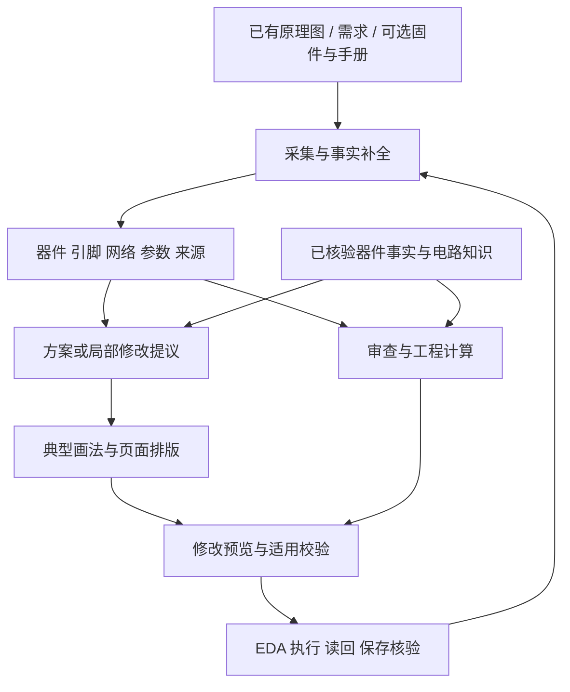

# Boardwise 原理图产品路线

日期：2026-09-18。范围：原理图审查、绘制与局部修改；PCB 自动布局布线不进入本轮产品路线。

这是根据源码与上游文档形成的规划建议，未修改 `E:\boardwise` 实现或原有架构约定。下文周期和指标都是建议目标，不是当前成绩或交付承诺。

## 1. 决策建议

**继续做 Boardwise，但承认底层路线已经重叠，把优先级转向原理图工程审查和可控修改的实际效果。**

建议第一个产品承诺：

> 帮硬件工程师审查现有原理图，指出有依据的问题，生成可读的局部修改，并核对修改与保存结果。

完整体验是：**读取现有图 → 审查 → 定位与解释 → 修改预览 → 应用授权的修改 → 复查 → 保存。**

先覆盖熟悉的 3.3V/5V MCU 控制与接口电路：稳压、上拉、分压、滤波、复位、晶振、UART/I²C/SPI、简单采样。首个绘制目标限定单页、约 15–40 件；扩大到 1–3 页、约 100 件需通过下一阶段验收。器件数量只描述测试范围，不代表复杂度保证。复杂电源控制、高精度模拟、RF 需要独立知识包与验收。

这里的竞争单位是“工程师把一项任务做完需要多久、需要返工多少”，而不是命令数量或模型调用次数。审查数据、典型画法、增量修改能力也都可能被竞争者实现；差异必须通过具体电路与用户任务验证。

## 2. 上游路线核对：重叠已经发生

通过已登录的 gh CLI 读取公开仓库，固定源码版本：

- 仓库：<https://github.com/zhoushoujianwork/easyeda-agent>
- main：`b66bb7599b4d1e91fd331171675a5556dc02d6c7`，提交时间 `2026-09-17T16:59:01Z`，北京时间 9 月 18 日 00:59。
- 查询时最新 release：`v1.5.1`，发布时间 `2026-09-17T16:02:36Z`。main 与 release 分开记录，未运行其安装包或真机验收。
- 原文、部分实现和查询结果保存在 `../work/upstream-2026-09-18/`。

### 必须修正上次比较

旧本地副本体现“Skill 编排工具、逐步下沉计算”；当前上游已经明确采用：

```text
原始快照 + 需求/手册证据
  → 目标连接数据 + 核心/外围归属 + 约束
  → 区内布局计算
  → 整页候选选择与平移
  → 数据校验与固定预览
  → compose / Apply
  → 官方回读、严格检查、显式保存
```

`ROADMAP.md` 顶部明确把 2026-08 的状态、计数和待办标为历史，并指向新的规范。不能把其旧“block apply 待开发”等段落当作当前缺口。

| 方向 | 当前上游证据 | 对 Boardwise 的含义 |
|---|---|---|
| 连接事实与几何分离 | Connectivity IR；稳定实例 ID、pin→net、NC；几何可重算 | 这是共同的基础，不能单独构成差异 |
| 模型少算坐标 | `layout-plan --zones`、`layout-sheet-plan`；显式所有权和约束 | 两层自动布局已在同一路线上 |
| 先计算、后执行 | 固定 `layout-render`、`compose --layout-page`，Apply 读回 | “确定性编译 + 门禁”也已重叠 |
| 可读性 | 专属外围归属、真实直连、阅读顺序、位号、框与标题 | 不能再把对方描述成只管网表或标签 |
| 局部修改 | `layout-edit`：移动核心和所属区、修单脚标记；有限范围恢复 | 局部编辑已有部分实现，后续须比较任务覆盖与可靠性 |
| 审查 | 严格几何/连接门、所有权审查提示、证据覆盖报告 | Boardwise 应深入具体电气审查，不能笼统声称对方没有审查 |
| 产品范围 | 建库、原理图、PCB、交付全流程 | Boardwise 可集中工程投入，先兑现原理图体验 |

代码抽查发现，`cmd_sch_compose.go` 的生成队列确实包含逐 pin/net/NC 验证、连接检查、strict gate 与 `saved:true` 断言；`sch_layout_zones.go` 确实验证显式唯一归属。因此，上述内容不只是 README 愿景。但有限源码核对仍不等于所有场景、安装版本和宿主上的质量已得到验证。

上游也明确承认有界搜索失败不代表无解、未知数据不能算通过、Apply 不提供事务回滚、部分检查需按安装版本举证。公开 issue #216 报告 v1.4.8 / EasyEDA Pro 3.2.186 的写入持久化问题；它是特定版本用户报告，不能推断 v1.5.1 一定仍有同样问题。这类案例适合纳入自己的“保存并重开”验收。

主要来源：

- [现行架构](https://github.com/zhoushoujianwork/easyeda-agent/blob/b66bb7599b4d1e91fd331171675a5556dc02d6c7/docs/architecture.md)
- [路线图及历史状态说明](https://github.com/zhoushoujianwork/easyeda-agent/blob/b66bb7599b4d1e91fd331171675a5556dc02d6c7/docs/ROADMAP.md)
- [数据驱动架构基准、数据模型与局部编辑](https://github.com/zhoushoujianwork/easyeda-agent/blob/b66bb7599b4d1e91fd331171675a5556dc02d6c7/skills/easyeda-agent/references/schematic-data.md)
- [计算与 Apply SOP](https://github.com/zhoushoujianwork/easyeda-agent/blob/b66bb7599b4d1e91fd331171675a5556dc02d6c7/skills/easyeda-agent/references/auto-layout-sop.md)
- [功能现状](https://github.com/zhoushoujianwork/easyeda-agent/blob/b66bb7599b4d1e91fd331171675a5556dc02d6c7/docs/FEATURES.md)
- [最新 release（本次查询）](https://github.com/zhoushoujianwork/easyeda-agent/releases/tag/v1.5.1)
- [特定旧版本持久化问题报告 #216](https://github.com/zhoushoujianwork/easyeda-agent/issues/216)

## 3. Boardwise 当前基线与优先缺口

| 当前资产 | 本次核对 | 下一步 |
|---|---|---|
| 离线设计模型与解析器 | 已有 netlist、工程备份解析，core/engines/bridge 分层 | 扩展数据契约，保留现有解析和比对路径 |
| CH340 块回放 | 本次复跑：17 件、13 网，compare 零差异；lint 0 | 保留为回放回归，另加未从黄金切出的电路 |
| 审查引擎 | `engines/review.py` 注册 3 条 L1 启发式规则 | 先补器件身份与引脚职责，再扩工程规则 |
| 规格校验 | 闭卷来源、引脚预算、电平、电源树已有实现 | 统一报告；电气规则与评测纪律分离 |
| 校验到绘制的衔接 | `cli.py::_cmd_draw` 的 spec 分支直接 load→assemble；未调用 `validate_spec` | 将适用的电气校验接入所有绘制入口，失败阻断写入 |
| 布局模板 | 当前 5 个块：4 个 CH340 切块，1 个 AMS1117 块 | 不用数量判断覆盖；增加基本拓扑画法和真实符号适配 |
| 新块绘制 | 空内部几何路径逐 pin 合成标签/电源短桩 | 增加直接导线与拓扑画法，标签作为明确的表达策略 |
| 器件选型与固件引脚表 | curated 件库、值门禁、BOM 与 pin table 已有基础 | 纳入共享事实库；固件是可选输入，普通审查不强制提供 |
| 桥与回读 | 已有放置验证、异步网表 settle、结果记录 | 验证持久化、超时后的实际状态、稳定 ID 与版本对应 |

三个早期修正应排在新增功能前：

1. **验证入口贯通。** 将 `validate` 和 `draw` 的公共必检项统一到编排入口，并绑定输入修订；不能依靠模型先记得运行一个命令。修改规格后旧通过结果必须失效。
2. **评测纪律分离。** 当前 `validate_spec` 的 closed-book 闸要求 `target`。这是“生成测试不能偷看答案”的纪律，不是用户设计新板必须提供另一块黄金板的产品要求。独立 benchmark 模式保留；运行时保留来源完整性与适用性检查。
3. **电平转换建模修正。** 当前 `_gate_levels` 对一个多电平网络，只要参与块声明 `level_shifter` 就可转为 note。转换器的两侧通常应属于不同网络；要检查各侧供电、方向和合法范围，不能用一个布尔标志豁免混接。
   ✅ **已落地（M0-P0c，2026-09-18）**：豁免与 `level_shifter` 字段整体删除，同网多域
   永远 fail；合法双侧转换（两侧各一张网、各侧电平与端口声明一致）已作为验收测试固定。
   见 `tasks/009c-net-role-fixes.md` 末尾的落地记录。

另一个值得尽早清理的基础假设：`is_ground_net` 把 `VEE` 列为地名称前缀；它也可能是负电源。网络角色应来自声明和器件事实，名称只能提供可追溯的候选推断。
   ✅ **已落地（M0-P0c，2026-09-18）**：`VEE` 移出 `GROUND_NET_PREFIXES`，
   `engines/layout.py` 自带的地名正则删除、统一调用 `is_ground_net`（第二处实现消除）；
   负电源不再挂地符号。**不**新增"负电源"角色——那是 M1 器件事实库的事。

这些是静态源码发现，未在本轮修复或进行负例运行。

## 4. 建议架构：共享事实，审查与绘制各有明确职责



### 4.1 四类数据要分清，不必立即拆成四个服务

| 数据 | 内容 | 权威与用途 |
|---|---|---|
| Observation | 原始工程/页面、引脚与几何、时间、宿主版本、采集覆盖 | 说明实际读到了什么；不可覆盖原观测 |
| CircuitSpec | 稳定实例 ID、实际引脚号、net/scope、参数、NC、已确认悬空和未知 | 表达目标电气连接；位号是可改显示名，不作为唯一身份 |
| PresentationSpec | 功能归属、画法、信号流、直连/标签策略、相对关系、用户锁定 | 表达图纸怎样让人理解；布局引擎消费 |
| ChangePlan / Report | 前置修订、受影响范围、计划动作、检查结果、执行/保存状态 | 支持审阅、应用、失效判定与恢复 |

在现有 dataclass 和文件接口上逐步扩展，保留旧 `BoardSpec` 的适配器。没有必要重写 Python 内核、增加数据库或搭一套独立前后端。

### 4.2 审查不要求先认识整张图

读取用户现有图后，先输出身份已知的器件和能确定的连接问题。缺型号、缺引脚属性、缺负载条件时，列出具体受影响检查，并只向用户索要这些信息。

普通审查不能因为一个陌生芯片而整个失败，也不能把未检查部分涂成绿色。导入初期不强制每件器件都有功能块；识别、建议、确认可分步进行。关键修改涉及的对象则必须有足够事实。

报告至少分开：

- `fail`：适用规则有事实支持的违规。
- `pass`：该项已检查并满足。
- `unknown`：条件或证据不足，说明缺什么。
- `not_applicable`：已知条件不适用，给出理由。

高优问题显示器件/引脚/网络、原值、限制值、条件、来源页码、建议动作。用户接受的例外与不适用不是一回事：例外保留理由、对象范围、失效条件。草稿可带未决项展示，具备必检条件的修改才允许进入“已验证应用”。

### 4.3 模型与代码的分工

模型负责需求歧义、候选方案、电路功能、引用提取、例外解释以及提出修改。代码负责身份解析、单位与公式、连接构造、几何、检查、执行和读回。

模型可以说“这是分压器，中点向 MCU 输出，靠近采样部分”，不必提交每个 x/y。参数可以由模型提议，但要通过工程计算与器件约束检查。用户有明确摆位要求时允许锁定位置，不应为了消除模型坐标而取消工程师控制权。

成熟块命中：便宜模型选择和填参。新拓扑或关键约束：更强模型提出方案，经相同工具处理。低成本目标通过实测选择；起步阶段用一个可靠模型建立系统基线，避免同时调试模型与工具。

### 4.4 电路知识的三个层次

1. **器件事实**：精确型号/后缀、封装、引脚、电压范围、引脚类型、参考来源、核验版本。BOM 身份不等于完整电气事实。
2. **电路配方**：连接拓扑、参数关系、适用条件，如分压范围、LDO 压差与电容条件；不绑定唯一的坐标。
3. **图纸画法**：分压上下串联、RC 在信号路径上、反馈回绕、外围归属与文字位置。与真实符号引脚几何适配。

旧板切块作为固定布局资产继续使用；不要把“符号几何固化”和“适用电路知识已验证”视为同一件事。

审查与生成共享经过核验的器件事实和规则定义，验收仍需独立检查：从 EDA 读回重建实际图，使用独立计算和人工标注反例核对。复制生成器的错误结果作为 expected 不能证明电气正确。

### 4.5 人工编辑与再生成

维护“上次已落地基线、当前 EDA 实况、新目标”三份状态。执行前发现用户改动，先识别哪些字段冲突；无冲突变化可纳入基线，冲突按字段展示处理。保留手工位置锁、说明文字和不在本次范围内的对象。

写入超时后先读实际状态，不能把超时解释为没写入而重复创建。首版依靠检查点与重读后重计划；只有恢复机制经过宿主验证才承诺自动撤销，避免为 MVP 建造通用事务系统。

## 5. 分阶段交付

按“1 名主要开发者 + AI 辅助、每周可进行真实 EDA 验证”估算，总计约 **12–17 个工程周**。实际工期由宿主兼容性、知识录入和试用反馈决定；前两周测量后调整。阶段以验收结果晋级，不能用日期替代通过。

| 阶段 | 估算 | 对用户的结果 | 晋级条件 |
|---|---:|---|---|
| M0 基线与统一入口 | 1 周 | 系统如实报告读到了什么、检查了什么、是否保存 | 既有基线保持；关键校验进入写路径；失败不能假成功 |
| M1 有用的原理图审查 | 2–3 周 | 现有图上定位少量高价值、可解释的问题 | 在声明支持范围内达到审查精度目标，未知项清楚 |
| M2 常见电路可读绘制 | 3–4 周 | 描述常见电路即可得到可读、可核对的局部图 | 无黄金坐标的基本拓扑用例通过独立连接与可读性验收 |
| M3 审查到局部修改 | 2–3 周 | 接受某项建议，只改变相关电路并复查 | 范围外保持、冲突可见、超时恢复不重复创建 |
| M4 整页组合与模型分层 | 2–3 周 | 多个成熟电路组合成初稿，模型成本可量化 | 未见过的板级组合、低成本对照与草稿质量达到目标 |
| M5 小规模真实试用 | 2–3 周 | 外部工程师在自己的项目中完成任务 | 无开发者接管的重复使用与可量化节时 |

### M0：先让现有链路闭合

交付：

- 记录 CLI、connector、schema、规则与算法版本；明确支持的宿主版本。
- 校验入口统一，电气评估与 benchmark 的 closed-book 检查解耦。
- 确认器件库引脚几何来源；未知不生成假坐标。规划估计与实际核验分开标记。
- EDA 写入、读回一致、保存确认、重新打开保留分别记录。`saved:false` 需结合脏状态和持久化证据解释，不能只看 API `ok:true`。
  ✅ **已落地（M0-P0d，2026-09-18）**：三态（`placed` / `saved_unverified` /
  `saved_verified`）在 draw 报告与审计日志里分开表达；超时先重读、不重复创建，退出码 3
  表达"未知/部分完成"。**`saved_verified` 无法由桥建立**（`doc.open` 不重载磁盘、没有
  关工程动作）⇒ 真机四场景检查单 `docs/persistence-baseline.md` 是唯一判据来源。
  ⚠️ 勘误：`saved:false` 这条假设在本宿主**不存在** —— connector 在 `sch_Document.save()`
  为假时是 **throw**，成功才返回 `{saved:true}`；原来的问题是**返回值被丢弃**，已修。
  审计记录与交卷见 `tasks/009d-persistence-baseline.md`。
- 建立 `PROGRESS.md`/实际版本记录以及可复现基线；`E:\boardwise` 当前未检出 Git 仓库，应尽早开始版本管理。

验收：CH340 compare/lint 回归；规格电气反例在第一次写入前被拦截；缺少必需几何与读回未稳定均不报完成；在专用测试工程进行保存重开、断连和部分写入验证。现场操作与离线回归分开记结果。

### M1：先完成约 10–15 条有适用条件的审查规则

第一批先选约 5–10 个用户实际常用 IC，配合基础无源与接插件身份，建立小而可信的事实库。

| 规则族 | 第一版检查 | 必须说明的条件 |
|---|---|---|
| 连接与身份 | 重复位号、引脚号/封装版本、NC 与连接冲突、已知必接脚 | 未知脚不得自动判 NC；多单元与跨页作用域要明确 |
| 供电 | 供电脚接到哪个域、是否超过运行/绝对限制 | 额定工作范围与绝对最大值分开；负电源不按地处理 |
| 电源路径 | 已声明源/汇、简单稳压压差、已知负载下的额定电流 | 无负载预算时输出 unknown；合法 OR-ing/多源须单独建模 |
| 去耦 | 已知 IC 供电脚与规定电容连接、数值与耐压条件 | 原理图无法证明 PCB 贴近或回流质量；共享电源网上有电容不自动证明符合每芯片要求 |
| 数字接口 | 推挽冲突、开漏上拉、逻辑门限/耐压、转换器两侧 | 方向、供电和工作模式未知时不硬猜；双向总线需要适用规则 |
| 常见参数 | LED 限流、分压输出范围、简单 RC 截止频率 | 纳入已知容差、输入范围与负载；不能只验证“是一个电阻值” |
| MCU 外围 | 特定型号复位/启动脚、晶振或外部时钟接法 | 不把所有晶振样式都当作需要相同负载电容 |
| 固件接口 | 可选 pin table/.ioc 与硬件接口比对 | 只做能证明的引脚事实，模式切换和复用例外单列 |

建议验收集：约 10 份原理图片段/小板，至少 30 个独立标注缺陷，加正常与例外样例。保留一部分不参与规则调试。高优确定问题精确率初始目标 ≥95%，支持范围内人工注入缺陷检出率目标 ≥90%；分母、未知数和逐规则结果一起报告。样本小的时候同时列出原始分子/分母，不能包装成通用统计保证。

### M2：基本画法优先于大而全的求解器

建议顺序：

1. 上下拉、LED 限流、分压、RC。
2. LDO、晶振与复位、简单接口及去耦。
3. 单级运放反馈、简单三极管/MOS 开关。最后两类需限定型号与工况。

按拓扑生成关系，再用真实符号几何实例化；优先直线和少折弯的正交线，有界绕障；仍失败则报告冲突，不能自动改成逐脚标签来假装画完。

模块内部应能看见主要拓扑；长距离或高扇出连接按明确策略命名。布局检查覆盖器件、引脚、线、网络名、位号及**关键可见参数值**。非必要的供应商等元数据可以不显示，电阻值/电容值是理解电路的重要内容，不应全面从可读性验收中排除。

验收：每种画法至少两种真实符号形态；更长网络名、旋转/镜像、增减外围、参数变化、不同纸张范围。黄金拓扑可用于独立验证，但不能把目标布局作为输入。分开记录电气一致、几何合法、工程师阅读分数和返工分钟数。仅画得漂亮不能弥补连接错误。

建议目标：8–12 种基本画法，已声明支持的测试集中一次生成率 ≥90%，完成样例逐 pin/net/NC 一致；工程师按“拓扑可辨、流向明确、文字可读、分组合理”四项评分，中位数 ≥4/5。所有失败样例也计入成功率。

### M3：把审查与绘制连接成真正的任务

优先支持 5 类修改：改值、补一颗必要器件、插入已知 RC/分压子电路、修正一处引脚连接、重新排版一个功能块。

每项修改包含电气差异、图纸差异、原因、影响范围和前置修订。执行仅针对明确范围；新增位号由代码分配；值改动不顺带整页重排。替换 IC、跨页迁移和复杂断网重接等高复杂任务后排。

验收：至少 20 项局部修改用例，含人为编辑冲突、旧快照、重复请求、执行半途断连、回读迟到。范围外电气与应保留的几何不变；实际变化与预览对账；重读后重计划不重复创建。正常板也允许带范围外既有问题工作，必须保证没有扩大问题，不能要求先修完整张图才改一个值。

这一阶段完成后，就能邀请少量用户反复体验，不必等待整页自动生成。

### M4：整页组合与更便宜模型

在成熟画法上增加功能分区、相对位置、阅读顺序与必要拆页。按“先区内合法，再整页安排”的方式推进；不要为压缩页数破坏功能归属或内部拓扑。

输入最少只需需求与已有工程。固件、精确料号、BOM、datasheet 可以是约束或补充证据，不强制用户一次备齐。输出是带未决项的可编辑初稿；“绘制完成”和“电气评审完成”独立标记。

模型对照分两层：

- 固定正确 CircuitSpec，比较各工具/绘制路径，检验编译能力。
- 同一原始需求与证据，比较模型生成 CircuitSpec 并调用同一工具的效果，检验智能设计与系统成本。

建议固定 12 项未用于模板提取的任务，按块复用、基本画法新组合、新拓扑分组；两档模型每项至少 3 次，记录失败、重试和人类介入。工具、知识库与检查版本固定，输入权限一致。

指标：总模型费用、总耗时、工具调用与等待、人工修改时间、高优电气缺陷、可读性。目标可设为常见任务总模型费用降低 ≥50%，且质量没有实质下降；达不到就保留可靠模型，不为低单价牺牲返工。开发期间不固定模型品牌，由实际评测选择。

### M5：用真实使用决定是否扩张

邀请 3–5 位熟悉目标领域的硬件工程师，在授权的自有工程上完成审查和局部修改。目标累计约 10 次真实任务，并至少有用户主动进行第二次使用。上述数量是试用设计，不是假定已经有人愿意使用。

记录首次安装/连接时间、有效问题比例、实际修正比例、开发者介入次数、净节省时间、未支持规则与绘图失败。建议用同类任务人工基线作对照，目标审查加修改耗时降低 ≥30%。只要高优误报、数据丢失或重开不持久化反复发生，就优先解决，暂缓扩规则/模型/平台。

## 6. 第一批可执行任务：未来两周

这些任务沿现有目录推进，建议路径中的新文件尚未创建。

| 优先级 | 任务 | 落点 | 完成标准 |
|---|---|---|---|
| P0 | 固定当前版本与回归输入 | 项目版本管理、`tests/fixtures`、文档 | 能恢复当前可用版本；明确宿主/connector/Python 版本 |
| P0 | 统一绘制前电气校验 | `cli.py`、`engines/validate_spec.py` | `draw --spec` 的适用校验不可漏跑；错误反例首次写入前停止 |
| P0 | 分开正常校验与闭卷评测 | `validate_spec.py`、CLI 参数与报告 | 新项目没有 golden 仍可校验；评测时仍能检测目标泄漏 |
| P0 | 修正电平转换和网络角色假设 | `core/model.py`、端口元数据、`validate_spec.py` | 低/高压同网反例失败、合法双侧转换通过、负电源不归地 |
| P0 | 建立持久化与失败现场基线 | connector/bridge/draw 的报告与专用工程 | 保存重开内容一致；超时先重读，不把未知写入当未执行 |
| P1 | 审查结果增加覆盖与适用条件 | `rules/base.py`、`engines/review.py` | 无问题、未检查、不适用可区分；所有高优问题可定位 |
| P1 | 录入第一批已核验器件事实 | 建议 `knowledge/parts` | 从当前常用 IC 中选 5–10 个；引脚/限值带精确出处 |
| P1 | 形成第一组独立正反样例 | `tests` 与评测目录 | 覆盖供电、上拉/电平、分压三个规则族；正常板不被普遍误报 |

第一周以 M0 完成为主；第二周进入 M1 的三个规则族。若持久化/身份采集仍不稳定，继续 M0，不把第三周排成更大的生成演示。

## 7. 验收设计：三条轨道，避免自我证明

| 轨道 | 输入 | 主要判据 |
|---|---|---|
| 审查 | 独立来源的正常与有缺陷工程，含合理例外 | 缺陷精确率/召回、规则适用覆盖、定位与解释、误报处置时间 |
| 绘制 | 正确电路结构 + 真实器件几何，目标图面不作为输入 | 实际 pin→net/NC、物理直连、关键文字、阅读评分、重开持久化 |
| AI 完整任务 | 原始需求或已有图，不喂标准答案 | 需求满足、设计错误、费用/耗时、人工介入和返工 |

每一项都保存失败输入、工具和知识版本、执行结果。机检用正负例，电气规则用独立手算/器件依据，图纸用工程师评分。无需为可逆的小文档修改造测试，也不要把“测试数只增不减”作为质量指标。

注意：没有 DRC 错误不等于电气可用；原理图去耦正确不等于 PCB 布局正确；同名标签联网不等于画出了易理解的反馈或采样路径；两次相同回读也不单独证明已持久化。

## 8. 与 easyeda-agent 的关系和投入边界

建议保留 Boardwise 的离线知识、审查、规划能力和现有薄连接器，短期不为追赶上游重写全部底层。先解决用户任务，再决定哪些执行能力复用上游。

上游的器件库身份、原始几何采集、连接语义、页面守卫和读回经验可作为参考；如采用其 CLI，应通过一个明确适配层接入、固定版本，并核验输出能力。不能同时让两个系统各自拥有整套目标数据和布局决定权。

本次读取的上游 LICENSE 主体是 MIT，另注明 `extension/src/beautify/` 的 Apache-2.0 例外；日后复制具体代码时按对应文件保留归属和许可。本轮只保存研究副本，没有引入产品依赖。

建议的范围纪律：

- 接口开发只服务本轮原理图任务；PCB 写操作、自动路由与 DFM 不进入里程碑。
- 不新建独立 EDA 编辑器，不把聊天 UI 当作第一阶段核心。
- 不批量生成几百个未验电路块；先把高频画法和器件事实做实。
- 不承诺任意 PDF 一键得到可靠电路库。先做证据提取候选，再核验后入库。
- 不把通用模拟仿真设为首版前置；先使用有适用范围的工程计算，后续按用户问题引入仿真。
- 不为“模型越便宜越好”提前投入调度系统；模型分层在工具基线稳定后实测。

定期检查工程投入：若连续两个迭代多数时间都耗在桥兼容性，专门做一个小范围适配评估，比较现有桥与上游执行层。若审查误报过多，缩小支持器件范围；若模板外成功率低，优先基本画法；若用户审查后无法方便修改，优先 M3。不要因看到上游新增命令就改排期。

## 9. 本次核对与文件记录

已完成：

- 通过绝对路径调用已安装 gh CLI，读取最新 main、release、路线/架构/规范、近期提交和相关公开 issue。
- 将 15 份文档/许可/部分源码及查询结果保存在当前研究工作区；未操作上游 issues、PR、发布或 EDA。
- 重读 Boardwise 架构、审查、规格校验、块模型及绘制入口。
- 运行两条已有离线检查，均 exit 0：

```powershell
$env:PYTHONPATH='E:\boardwise\src'
& 'E:\boardwise\.venv\Scripts\python.exe' -B -m boardwise.cli compare --spec blocklib/specs/ch340g_usb_uart.json --golden tests/fixtures/ch340_golden.epro2 --overrides tests/fixtures/ch340_golden.overrides.json
& 'E:\boardwise\.venv\Scripts\python.exe' -B -m boardwise.cli lint --spec blocklib/specs/ch340g_usb_uart.json
```

结果：17 件、13 网，带已存在的黄金旁车修正后 compare 零差异；lint 0。旁车命中与来源均由命令显示。这证明当前 CH340 离线基线有效，不证明其他电路、新规则或当前宿主真机生成通过。

未运行：完整测试套件、上游编译/测试、EDA 写入、模型对照、用户试用。没有改动 Boardwise 代码，也没有自动实施本路线的架构变更。

当前研究工作区与 `E:\boardwise` 均未检出 Git 仓库。本报告及进度记录保存于当前获准写入的研究工作区，未写入 E 盘项目。
